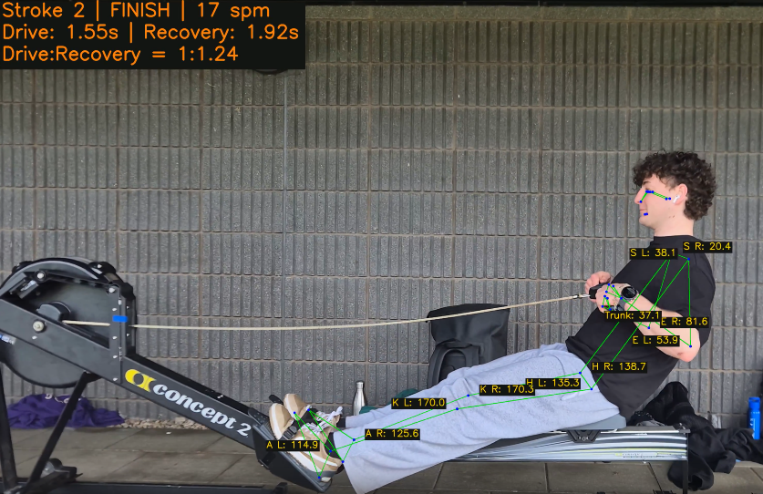
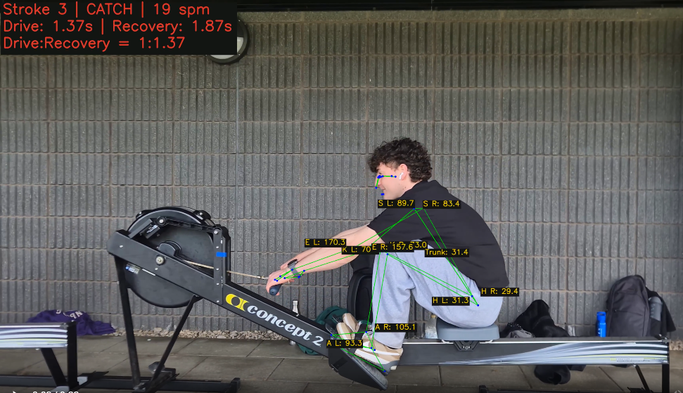

## StrokeAI

### A computer vision program to analyse rowing strokes.

## Implemented Features

- Pose Estimation for Single Frame
    - Uses MediaPipe Pose Landmarker from Google for Pose Landmarking
- Pose Estimation for Video
- Key Joint Angle Extraction
    - knee
    - hip
    - elbow
    - shoulder
    - ankle
    - trunk lean

- Stroke Phase Extraction
    - Extracts Catch, Drive, Finish and Recovery phases from video
    - Calculates Stroke Rate
    - Calculates Drive Time and Recovery Time
    - Calculates Drive : Recovery Ratio


## How to Run

The analysis workflow is in [`notebooks/erg-analysis.ipynb`](notebooks/erg-analysis.ipynb).
Run these commands from the project root in PowerShell:

```powershell
py -3.12 -m venv .venv
.\.venv\Scripts\Activate.ps1
python -m pip install -r requirements.txt
Set-Location notebooks
jupyter lab erg-analysis.ipynb
```

The notebook uses the model at `models/pose_landmarker_full.task` and expects its
input videos in the `assets` folder. That folder is not tracked by Git, so add
your own video there and update the video path in the notebook if needed. When
running the notebook in VS Code, select `.venv` as the notebook kernel and run
the cells in order.


## Images

Frame from a video showing pose estimation, key joint angle extraction and stroke phase extraction





## Methodology

### Pose Estimation and Key Joint Angle Extraction
1. Use MediaPipe Pose Landmarker from Google ([Link](https://developers.google.com/edge/mediapipe/solutions/vision/pose_landmarker/index?_gl=1*z8jxl0*_up*MQ..*_ga*NDE0OTUwMzcwLjE3OTA4NzQyMzU.*_ga_SM8HXJ53K2*czE3OTA4NzQyMzQkbzEkZzAkdDE3OTA4NzQyNDckajQ3JGwwJGgw#models)), which, given a frame of a human, returns 33 key landmarks on human body.
2. Extract key landmarks for rowing analysis:
    - knee
    - hip
    - elbow
    - shoulder
    - ankle
    - trunk lean

3. Calculate angles involving these key joints
4. Annotate frame with the landmarks, connections between landmarks, and key angles
5. Use this process for each frame of a video, to obtain an annotated video

### Stroke Phase Detection
Catch
- the local extreme where the handle is the closest to the flywheel
- seat is also closest to flywheel
- knees are most compressed
- shins near vertical

Drive
- from catch until the finish
- handle moves away from flywheel
- legs extend, then trunk/hips, then arms

Finish
- handle is closest to the body/ furthest from flywheel
- legs fully extended
- elbows most back

Recovery
- from finish to catch
- arms extend, then trunk/hips lean over, then legs compress

Approach
1. Run pose estimation on every frame and keep the landmarks and joint angles as time series
2. Build a 1D handle position signal using average of two wrists
    - Wrists projected onto the principal axis of motion
    - Oriented so that low values = catch and high values = finish
3. Find the catch (valleys) and finish (peaks) with `scipy.signal.find_peaks`, then label drive / recovery between them
    - Allowing us to calculate rate, drive time, recovery time and drive:recovery ratio
    - Catch and finish are 10% windows around the extreme values (configurable as argument to `detect_strokes`)

4. Validate each stroke with the knee angle and stroke rate
    - Only accepts spm 10-50 (configurable as argument to `detect_strokes`)
    - Knee angle must be more bent at catch than finish

5. Overlay stroke data on video alongside pose estimation data
    - Stroke no, stroke phase, rate, drive time, recovery time and drive:recovery ratio

    
## Models

- Pose Estimation 
        - Using MediaPipe Pose Landmarker from Google ([Link](https://developers.google.com/edge/mediapipe/solutions/vision/pose_landmarker/index?_gl=1*z8jxl0*_up*MQ..*_ga*NDE0OTUwMzcwLjE3OTA4NzQyMzU.*_ga_SM8HXJ53K2*czE3OTA4NzQyMzQkbzEkZzAkdDE3OTA4NzQyNDckajQ3JGwwJGgw#models))


## Planned Features

- Form Analysis
    - Catch
    - Knee and hip angles
        - Gives a picture of how compressed rower is at the catch
        - Shins should be almost vertical

    - Trunk lean
        - Rough posture measurement
        - Should not be collapsing at the catch

- Finish
    - Knee extension
        - Are legs fully extended at catch, or is there length left on the table

    - Trunk lean
        - Are you leant too far back or not leant back enough?

    - Elbow flexion
        - Are you bringing your arms all the way into the body
        - Are you finishing too high/low on the body

- Sequencing
    - Compare when legs, hips and elbows start moving 
    - Check for:
        - early body opening, 
        - arms engaging too soon, 
        - not connecting with legs


- Stroke Data
    - Drive : Recovery ratio should be 1 : 2 at lower rates


- V1 - Rule Based
    - Gather rules from dataset of professional rowers

- V2 - Statistical
    - Calculate mean sequencing, angles, etc over a period of strokes and compare to benchmark

- V3 - ML Classifier
    - Label strokes for different flaws (i.e., early body opening)
    - Train XGBoost model

- V4 - Deep Learning
    - Feed time series data into Transformer

- V5 - Input into LLM
    - Provide LLM with data to provide natural language feedback